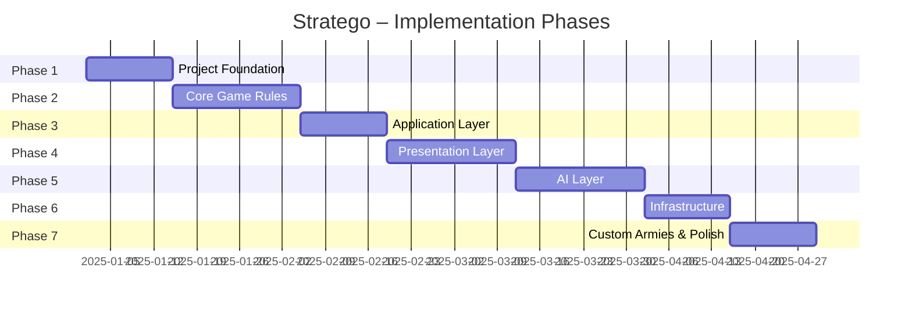

# Stratego – Phased Implementation Plan

**Document type:** Implementation Plan  
**Version:** 1.0  
**Author:** Senior Business Analyst (Python Game Specialist)  
**Status:** Approved  
**Specification refs:** All documents in [`/specifications/`](../specifications/)

---

## 1. Purpose

This document is the master implementation roadmap for the Stratego /
*Conqueror's Quest* Python application. It divides the full feature set into
**seven sequential phases**, each of which produces a shippable, testable
increment. A developer or coding agent can work through the phases in order
without needing to re-read the full specification suite.

---

## 2. Guiding Principles

| Principle | Implication for planning |
|---|---|
| **Domain-first** | Every phase starts by building and testing domain logic before adding UI or AI |
| **Testability ≥ 80 %** | Each phase ends with automated tests covering all new domain code |
| **No cross-layer imports** | Presentation layer never imports from AI or Infrastructure; domain never imports pygame |
| **Immutable GameState** | All state transitions produce a new `GameState`; no in-place mutation |
| **MoSCoW prioritisation** | Must Have items ship before Could Have items in every phase |

---

## 3. Phase Overview



| Phase | Name | Exit Criteria |
|---|---|---|
| **Phase 1** | Project Foundation | `uv run pytest` passes; all enum/dataclass models importable |
| **Phase 2** | Core Game Rules | All combat, movement and win-condition unit tests pass |
| **Phase 3** | Application Layer | Game loop runs headlessly; commands and events dispatch correctly |
| **Phase 4** | Presentation Layer | A complete human-vs-human game is playable through the UI |
| **Phase 5** | AI Layer | Hard AI (depth-6 minimax) completes a move in < 1 s |
| **Phase 6** | Infrastructure | Save/load round-trip works; settings persist across restarts |
| **Phase 7** | Custom Armies & Polish | Custom army mod loads and renders correctly; all integration tests green |

---

## 4. Phase 1 – Project Foundation

**Goal:** Establish the project skeleton, toolchain, and all domain enumerations
and dataclass models that every subsequent phase depends on.

### 4.1 Deliverables

| Deliverable | Module(s) |
|---|---|
| `uv` project with `pyproject.toml` | root |
| Folder structure matching `architecture_overview.md §7` | `src/`, `tests/` |
| Domain enumerations | `src/domain/enums.py` |
| Core value-object dataclasses | `src/domain/piece.py`, `board.py`, `player.py`, `move.py`, `game_state.py` |
| `pytest` configuration | `pyproject.toml` |
| `ruff` + `mypy` configuration | `pyproject.toml` |

### 4.2 Acceptance Criteria

- [ ] `uv run python -c "from src.domain.enums import Rank, PlayerSide"` exits 0.
- [ ] All 12 `Rank` enum members exist with the correct integer values
      (`FLAG=0`, `SPY=1`, … `MARSHAL=10`, `BOMB=99`).
- [ ] A `GameState` object can be constructed with a fresh 10 × 10 `Board`,
      two `Player` objects, and `phase=GamePhase.SETUP`.
- [ ] `mypy --strict src/domain/` reports zero errors.
- [ ] `uv run pytest tests/unit/domain/test_models.py` passes.

### 4.3 Key Decisions / Constraints

- Use Python 3.12 `dataclass(frozen=True)` for all value objects
  (see `ADR-003`).
- `BOMB` rank integer value is `99`; do **not** use `11`
  (see `data_models.md §3.1`).
- No pygame or I/O imports anywhere in `src/domain/`.

---

## 5. Phase 2 – Core Game Rules

**Goal:** Implement the complete, tested rules engine so that all Stratego
game logic is correct and independently verifiable without any UI.

### 5.1 Deliverables

| Deliverable | Module(s) |
|---|---|
| Board construction and lake map | `src/domain/board.py` |
| Movement validation (normal, Scout, immovable) | `src/domain/rules_engine.py` |
| Two-square rule enforcement | `src/domain/rules_engine.py` |
| Combat resolution (general + special cases) | `src/domain/combat.py` |
| Post-combat revelation | `src/domain/combat.py` |
| Win condition detection | `src/domain/rules_engine.py` |
| Setup zone validation | `src/domain/rules_engine.py` |
| State machine phase transitions | `src/domain/state_machine.py` |

### 5.2 Acceptance Criteria

- [ ] Scout can move from `(6,4)` to `(2,4)` in a single turn on an otherwise
      clear column; move is rejected if any piece occupies an intermediate
      square.
- [ ] Bomb at `(8,8)` defeats all attackers except Miner; Miner defeats Bomb.
- [ ] Spy attacking Marshal → Spy wins; Marshal attacking Spy → Marshal wins.
- [ ] Spy attacking any non-Marshal → Spy loses.
- [ ] Both pieces removed on rank-equal combat (draw).
- [ ] Flag capture triggers `GamePhase.GAME_OVER` with the correct winner.
- [ ] Player with only Bombs and Flag remaining triggers "no legal moves" win
      for the opponent.
- [ ] Two-square rule rejects a piece that tries to move back-and-forth more
      than twice consecutively.
- [ ] `uv run pytest tests/unit/domain/` passes with ≥ 80 % coverage.

### 5.3 Key Decisions / Constraints

- Rules engine functions are **pure** (no side effects): they accept a
  `GameState` and return a new `GameState` or raise a `RulesViolationError`.
- Lake squares occupy `(4,2)`, `(4,3)`, `(5,2)`, `(5,3)`, `(4,6)`, `(4,7)`,
  `(5,6)`, `(5,7)` (see `game_components.md §2.2`).
- Spy's special ability applies only when the **Spy initiates** the attack
  (see `game_components.md §9`).

---

## 6. Phase 3 – Application Layer

**Goal:** Wire the domain layer into a runnable game loop with commands,
events, and turn management – with no pygame dependency.

### 6.1 Deliverables

| Deliverable | Module(s) |
|---|---|
| Immutable command value objects | `src/application/commands.py` |
| Event Bus (publish / subscribe) | `src/application/event_bus.py` |
| Game Controller | `src/application/game_controller.py` |
| Turn Manager | `src/application/turn_manager.py` |
| Session lifecycle | `src/application/session.py` |
| Game Loop skeleton (no rendering) | `src/application/game_loop.py` |
| Screen Manager (abstract) | `src/application/screen_manager.py` |

### 6.2 Acceptance Criteria

- [ ] Publishing a `PieceMoved` event notifies all registered subscribers
      within the same frame.
- [ ] `GameController.submit_command(MovePiece(...))` with a valid move produces
      a new `GameState` and publishes `PieceMoved`.
- [ ] `GameController.submit_command(MovePiece(...))` with an invalid move
      publishes `InvalidMove` and does **not** mutate state.
- [ ] `TurnManager` alternates `active_player` after each valid move.
- [ ] `TurnManager` calls `AIOrchestrator.request_move()` when the active
      player is an AI type.
- [ ] Game Loop runs `process_input → update → render` without crashing in a
      headless (no-display) test environment.
- [ ] `uv run pytest tests/unit/application/` passes.

### 6.3 Key Decisions / Constraints

- All command objects are `dataclass(frozen=True)` (see `system_design.md §2.2`).
- Event Bus is the **only** application-layer shared service; no Singletons in
  the domain layer (see `architecture_overview.md §3a`).
- AI thinking is dispatched to a `ThreadPoolExecutor` future; the result is
  collected in the next `update()` that finds the future complete
  (see `system_design.md §3.2`).

---

## 7. Phase 4 – Presentation Layer

**Goal:** Deliver a fully playable human-vs-human game through the pygame UI
with all eight screens functional.

### 7.1 Deliverables

| Deliverable | Module(s) |
|---|---|
| Sprite manager (classic assets) | `src/presentation/sprite_manager.py` |
| Input handler (mouse clicks → `InputEvent`) | `src/presentation/input_handler.py` |
| pygame Renderer | `src/presentation/pygame_renderer.py` |
| Terminal Renderer (headless fallback) | `src/presentation/terminal_renderer.py` |
| `MainMenuScreen` | `src/presentation/screens/main_menu_screen.py` |
| `StartGameScreen` | `src/presentation/screens/start_game_screen.py` |
| `SetupScreen` (drag-and-drop piece placement) | `src/presentation/screens/setup_screen.py` |
| `PlayingScreen` (board + side panel) | `src/presentation/screens/playing_screen.py` |
| `GameOverScreen` | `src/presentation/screens/game_over_screen.py` |
| `LoadGameScreen` | `src/presentation/screens/load_game_screen.py` |
| `SettingsScreen` | `src/presentation/screens/settings_screen.py` |

### 7.2 Acceptance Criteria

- [ ] A human player can navigate: Main Menu → Start Game → (no army select
      yet) → Setup → Playing → Game Over → Main Menu without errors.
- [ ] Opponent pieces are rendered as **hidden** (face-down) until revealed by
      combat.
- [ ] After any combat, both involved pieces' ranks are shown to both players.
- [ ] An invalid move attempt highlights the selected piece in red and displays
      an error message for 1.5 s.
- [ ] The board correctly highlights lake squares as impassable (visual cue).
- [ ] The **Continue** button on the Main Menu is greyed out when no save file
      exists.
- [ ] The `SettingsScreen` persists resolution and fullscreen settings across
      application restarts.
- [ ] Terminal Renderer prints a valid ASCII board state for any `GameState`
      without a pygame display.
- [ ] `uv run pytest tests/unit/presentation/` passes (mocked pygame surface).

### 7.3 Key Decisions / Constraints

- All pygame API calls are confined to `src/presentation/`; zero pygame imports
  in domain, application, or AI layers (see `architecture_overview.md §3a`).
- Piece visibility is filtered **per-player** in the renderer; the domain model
  stores the true rank; the renderer applies the fog-of-war mask
  (see `game_components.md §3.2`).
- Screen transitions pass data via `on_exit()` / `on_enter(data)` dict
  (see `screen_flow.md §5`).

---

## 8. Phase 5 – AI Layer

**Goal:** Deliver a working AI opponent at three difficulty levels using
minimax with alpha-beta pruning.

### 8.1 Deliverables

| Deliverable | Module(s) |
|---|---|
| Piece value table and evaluation function | `src/ai/evaluation.py` |
| Move ordering heuristic | `src/ai/evaluation.py` |
| Minimax + alpha-beta | `src/ai/minimax.py` |
| Probability Tracker | `src/ai/probability_tracker.py` |
| Opening book (3 strategies × 3 difficulty levels) | `src/ai/opening_book.py` |
| AI Orchestrator (difficulty routing) | `src/ai/ai_orchestrator.py` |

### 8.2 Acceptance Criteria

- [ ] Easy AI (depth 2) selects a legal move in < 100 ms on a standard laptop.
- [ ] Medium AI (depth 4) selects a legal move in < 500 ms.
- [ ] Hard AI (depth 6) selects a legal move in < 950 ms (time-limited by
      `time_limit_ms` config).
- [ ] AI never selects an illegal move; if the rules engine rejects it, the
      orchestrator retries up to 3 times before raising an error.
- [ ] Probability Tracker correctly eliminates `BOMB` and `FLAG` from a
      piece's distribution after that piece moves.
- [ ] Opening book produces a valid 40-piece setup arrangement for all three
      difficulty levels and all three strategies.
- [ ] Evaluation function assigns `Flag` an infinite loss value; the AI always
      protects its own Flag.
- [ ] `uv run pytest tests/unit/ai/` passes.

### 8.3 Key Decisions / Constraints

- AI reads game state via domain models only; it **does not** mutate
  `GameState` directly — it produces `Move` value objects
  (see `architecture_overview.md §4`).
- Search depth is configurable via `config.yaml` `ai.search_depth`
  (see `system_design.md §8`).
- MCTS (Phase 2 / v2.0) is **out of scope** for this implementation plan
  (see `ai_strategy.md §4.4`).

---

## 9. Phase 6 – Infrastructure

**Goal:** Implement all I/O concerns: JSON save/load, configuration, and
structured logging.

### 9.1 Deliverables

| Deliverable | Module(s) |
|---|---|
| JSON serialiser/deserialiser for `GameState` | `src/infrastructure/json_repository.py` |
| Config loader (`config.yaml` → Python object) | `src/infrastructure/config.py` |
| Structured logger | `src/infrastructure/logger.py` |

### 9.2 Acceptance Criteria

- [ ] A `GameState` at turn 50 serialises to JSON and deserialises back to an
      **equal** `GameState` (round-trip test).
- [ ] Save file version field `"version": "1.0"` is written and checked on
      load; files with unknown versions are rejected with a clear error message.
- [ ] `JsonRepository.get_most_recent_save()` returns the most-recently written
      save file path, or `None` if no saves exist.
- [ ] `config.yaml` missing entirely uses hardcoded defaults without crashing.
- [ ] All domain-layer errors produce a `logger.error(...)` entry including a
      full stack trace.
- [ ] `pickle` is **never** used anywhere in the codebase (enforced by a
      `ruff` rule `S301`).
- [ ] `uv run pytest tests/unit/infrastructure/` passes.

### 9.3 Key Decisions / Constraints

- Save files are stored in `~/.stratego/saves/` by default
  (see `system_design.md §8`).
- Use Python standard library `json` module with a custom
  `JSONEncoder`/`JSONDecoder` (see `data_models.md §6`).
- `pickle` is explicitly rejected due to arbitrary code execution risk
  (see `technology_stack.md §11` and `ADR-004`).

---

## 10. Phase 7 – Custom Armies & Polish

**Goal:** Deliver the custom army mod system and complete end-to-end
integration testing.

### 10.1 Deliverables

| Deliverable | Module(s) |
|---|---|
| Built-in Classic army | `src/domain/classic_army.py` |
| Mod loader (discover + validate) | `src/infrastructure/mod_loader.py`, `mod_validator.py` |
| Sprite manager (mod-aware, GIF animation) | `src/presentation/sprite_manager.py` (extended) |
| `ArmySelectScreen` | `src/presentation/screens/army_select_screen.py` |
| Full screen flow with army selection | `src/application/session.py` (updated) |
| Integration test suite | `tests/integration/` |

### 10.2 Acceptance Criteria

- [ ] A valid mod folder (`army.json` + `images/`) is discovered and listed in
      `ArmySelectScreen`.
- [ ] A mod with a malformed `army.json` is skipped with a warning; the rest
      of the mod list loads successfully.
- [ ] An animated GIF piece image plays its animation loop in the Playing
      Screen at the correct frame rate.
- [ ] Omitted ranks in `units` fall back to Classic names without error.
- [ ] Path traversal attempt in an image path is rejected
      (see `custom_armies.md §10`).
- [ ] Full integration test: new game → army select → setup → play 10 turns →
      save → quit → reload → play to conclusion.
- [ ] `uv run pytest tests/` (full suite) passes with ≥ 80 % domain coverage.

### 10.3 Key Decisions / Constraints

- Mods affect **presentation only**; the domain layer is unchanged
  (see `custom_armies.md §2`).
- All image paths are resolved relative to the mod folder; absolute paths in
  `army.json` are rejected (see `custom_armies.md §10`).
- Classic army is always listed first and cannot be deleted
  (see `custom_armies.md §8`).

---

## 11. Testing Strategy

### 11.1 Test Pyramid

```
        ┌────────────────────┐
        │  Integration (few) │  End-to-end game sessions
        ├────────────────────┤
        │  Unit (many)       │  Every domain rule, command, event
        └────────────────────┘
```

| Level | Tool | Target coverage |
|---|---|---|
| Unit – domain | `pytest` | ≥ 80 % |
| Unit – application | `pytest` + `pytest-mock` | ≥ 70 % |
| Unit – AI | `pytest` | ≥ 70 % |
| Unit – infrastructure | `pytest` | ≥ 70 % |
| Integration | `pytest` | Key game flows |

### 11.2 Test File Structure

```
tests/
├── unit/
│   ├── domain/
│   │   ├── test_models.py
│   │   ├── test_board.py
│   │   ├── test_combat.py
│   │   ├── test_rules_engine.py
│   │   └── test_state_machine.py
│   ├── application/
│   │   ├── test_event_bus.py
│   │   ├── test_game_controller.py
│   │   └── test_turn_manager.py
│   ├── ai/
│   │   ├── test_evaluation.py
│   │   ├── test_minimax.py
│   │   └── test_probability_tracker.py
│   └── infrastructure/
│       ├── test_json_repository.py
│       └── test_config.py
├── integration/
│   ├── test_full_game_session.py
│   └── test_save_load_cycle.py
└── fixtures/
    ├── sample_game_states.py
    └── sample_save_files/
        └── turn_50.json
```

---

## 12. Definition of Done (Global)

All phases must satisfy these criteria before the phase is considered complete:

- [ ] All new code has type annotations; `mypy --strict src/` reports zero new
      errors.
- [ ] `ruff check src/ tests/` reports zero violations.
- [ ] `uv run pytest` passes.
- [ ] No `pickle` usage anywhere (`ruff` rule `S301`).
- [ ] No cross-layer imports (domain → presentation, domain → pygame, etc.).
- [ ] PR description references the phase deliverables checklist.

---

## 13. Out of Scope (v1.0)

| Feature | Planned for |
|---|---|
| Online multiplayer (WebSocket) | v2.0 |
| MCTS / ISMCTS AI | v2.0 |
| Mod marketplace | v2.0 |
| Board skin mods | v2.0 |
| Sound packs | v2.0 |
| Mobile / web front-end | v2.0 |
| Tournament mode | v2.0 |
| Account management / leaderboards | v2.0 |

---

## 14. Related Documents

| Document | Purpose |
|---|---|
| [`epics.md`](./epics.md) | Full epic catalogue |
| [`product-backlog.md`](./product-backlog.md) | Prioritised feature backlog |
| [`user-stories-epic-1-foundation.md`](./user-stories-epic-1-foundation.md) | User stories for Phase 1 |
| [`user-stories-epic-2-domain-layer.md`](./user-stories-epic-2-domain-layer.md) | User stories for Phase 2 |
| [`user-stories-epic-3-application-layer.md`](./user-stories-epic-3-application-layer.md) | User stories for Phase 3 |
| [`user-stories-epic-4-presentation-layer.md`](./user-stories-epic-4-presentation-layer.md) | User stories for Phase 4 |
| [`user-stories-epic-5-ai-layer.md`](./user-stories-epic-5-ai-layer.md) | User stories for Phase 5 |
| [`user-stories-epic-6-infrastructure.md`](./user-stories-epic-6-infrastructure.md) | User stories for Phase 6 |
| [`user-stories-epic-7-custom-armies.md`](./user-stories-epic-7-custom-armies.md) | User stories for Phase 7 |
| [`sprint-phase-1-foundation.md`](./sprint-phase-1-foundation.md) | Sprint plan – Phase 1 |
| [`sprint-phase-2-core-game-rules.md`](./sprint-phase-2-core-game-rules.md) | Sprint plan – Phase 2 |
| [`sprint-phase-3-application-layer.md`](./sprint-phase-3-application-layer.md) | Sprint plan – Phase 3 |
| [`sprint-phase-4-presentation-layer.md`](./sprint-phase-4-presentation-layer.md) | Sprint plan – Phase 4 |
| [`sprint-phase-5-ai-layer.md`](./sprint-phase-5-ai-layer.md) | Sprint plan – Phase 5 |
| [`sprint-phase-6-infrastructure.md`](./sprint-phase-6-infrastructure.md) | Sprint plan – Phase 6 |
| [`sprint-phase-7-custom-armies-and-polish.md`](./sprint-phase-7-custom-armies-and-polish.md) | Sprint plan – Phase 7 |
