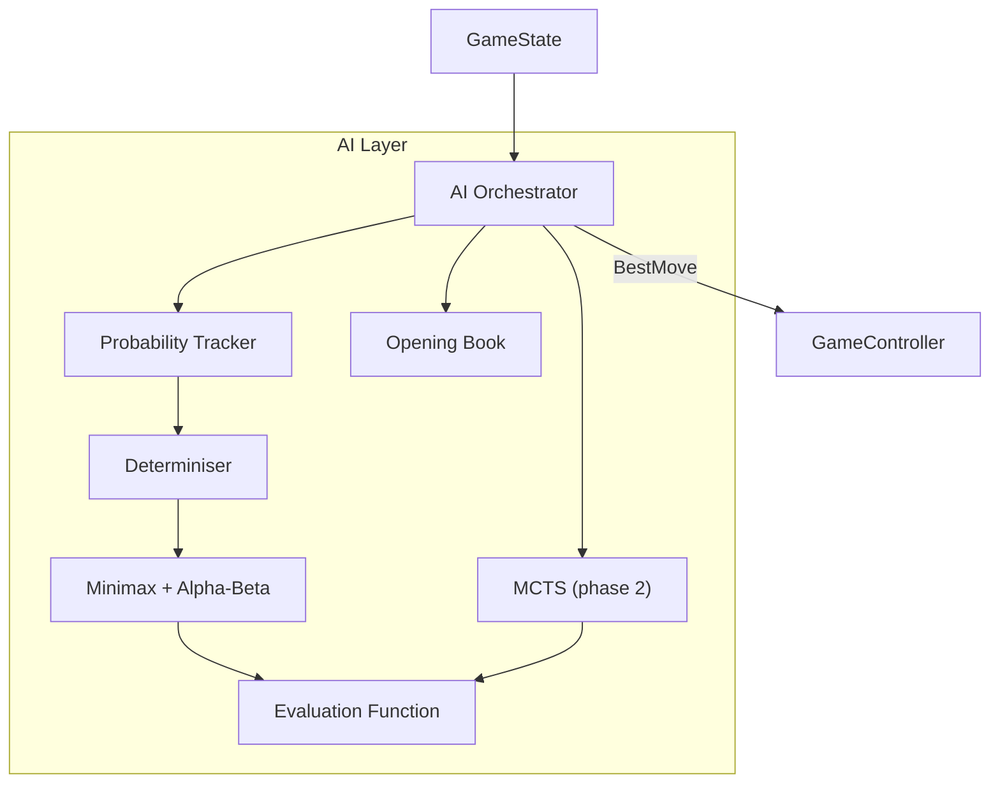

# Stratego – AI Strategy

**Document type:** AI Strategy  
**Version:** 1.0  
**Author:** Software Architect (Python Game Specialist)  
**Status:** Approved  
**Depends on:** [`game_components.md`](./game_components.md), [`data_models.md`](./data_models.md)

---

## 1. Purpose

This document defines the architecture and algorithm selection for the computer
opponent in Stratego. It covers the unique challenges Stratego presents to AI
design (hidden information), the algorithms chosen, difficulty scaling, and
opening strategy.

---

## 2. Why Stratego AI is Uniquely Challenging

Stratego is a **two-player zero-sum game with imperfect information**. Unlike
chess or draughts (perfect information), a player cannot see the ranks of
opponent pieces until combat reveals them. This means:

- Standard minimax is not directly applicable to the full game.
- The AI must reason under uncertainty about the opponent's piece identities.
- As pieces are revealed through combat, the probability distribution over
  opponent piece arrangements narrows.

> **Industry reference:** Research papers by de Boer et al. (2007) *"Opponent
> Modelling in Stratego"* and Stankiewicz et al. (2011) *"Master of the Flag"*
> (winner of the 2nd Computer Stratego World Championship) show that strong
> Stratego AI combines determinisation, probability tracking, and Monte Carlo
> sampling rather than pure minimax.

---

## 3. AI Architecture Overview



---

## 4. Algorithm Selection by Phase

### 4.1 Opening Phase (turns 1–10)

**Algorithm:** Opening Book  
**Why:** The first few moves have enormous strategic importance but large
branching factor. Experienced Stratego players have documented strong opening
formations. An opening book allows the AI to play strong openings instantly
without search cost.

**Example opening strategies documented by the Stratego community:**

| Strategy name | Description |
|---|---|
| *Blitz* | Scouts and high-rank pieces rush the centre early to attack and reveal opponent pieces |
| *Fortress* | Flag placed in back corner, surrounded by 3–4 Bombs, Miners distributed mid-board |
| *Probe* | Low-rank pieces (Scouts) advance first to map opponent piece positions before committing high-rank pieces |

The opening book stores 5–10 strong initial setups (piece arrangements) per
difficulty level. The AI selects one at setup time, optionally with small
random perturbations at lower difficulties.

### 4.2 Mid-game Phase (Phase 1 – Perfect Information Fallback)

**Algorithm:** Minimax with Alpha-Beta Pruning (determinised state)  
**Why:** In Phase 1 (v1.0), the AI treats revealed pieces accurately and
assigns *most likely ranks* to unrevealed opponent pieces based on the
Probability Tracker's estimates. This produces a determinised board that
minimax can search.

**Configuration:**

| Difficulty | Search depth | Notes |
|---|---|---|
| Easy | 2 | Shallow search; may miss obvious threats |
| Medium | 4 | Reasonable play; sees 2-move combinations |
| Hard | 6 | Plays near-optimally; alpha-beta makes depth-6 feasible |

**Alpha-beta effectiveness:** At depth 6 with a branching factor of ~30,
pure minimax would evaluate 30^6 ≈ 729 million nodes. Alpha-beta with good
move ordering reduces this to approximately 30^3 ≈ 27,000 nodes in the best
case, well within the 950 ms time budget.

### 4.3 End-game Phase (Phase 1)

When fewer than 10 pieces remain per side, the board is near-fully revealed.
Minimax at depth 8 or deeper is viable.

### 4.4 Phase 2 – Monte Carlo Tree Search (MCTS) with Determinisation

For v2.0, the AI will be upgraded to **Information Set MCTS (ISMCTS)**, the
same family of algorithms used by the award-winning *Hanabi* and *Skat* AI
systems.

**How ISMCTS works for Stratego:**

1. The Probability Tracker maintains a probability distribution over all
   possible opponent piece arrangements consistent with revealed information.
2. The Determiniser samples N boards from this distribution.
3. MCTS runs on each sampled board and aggregates the results.
4. The move with the highest average win rate across samples is selected.

> **Precedent:** *Master of the Flag* (Stankiewicz et al.) won the 2011
> Computer Stratego World Championship using a similar determinisation +
> search approach. The paper is publicly available and should be referenced
> by the implementation team.

---

## 5. Probability Tracker

The Probability Tracker maintains, for every unrevealed opponent piece, a
probability distribution over possible ranks.

**Initial state:** Uniform distribution over all unplaced opponent ranks.

**Updates triggered by:**

- A combat that reveals a rank → that rank is removed from the distribution
  for other pieces.
- An opponent piece moves → `BOMB` and `FLAG` are eliminated from its
  distribution (immovable).
- An opponent piece fails to defuse a Bomb → `MINER` eliminated from
  its distribution.
- An opponent piece survives combat with rank R → all ranks ≤ R eliminated.

**Data structure:**

```
For each unrevealed opponent piece:
    possible_ranks: set[Rank]
    probability: dict[Rank, float]  # normalised, sums to 1.0
```

---

## 6. Evaluation Function

The evaluation function assigns a scalar score to a `GameState` from the
AI's perspective. A higher score is better for the AI.

### 6.1 Components

| Component | Weight | Description |
|---|---|---|
| **Material** | 40 % | Sum of remaining piece values (see table below) |
| **Mobility** | 20 % | Number of legal moves available to AI pieces |
| **Flag safety** | 25 % | Distance from closest opponent moveable piece to AI flag; Bomb coverage |
| **Information advantage** | 15 % | Number of opponent pieces whose ranks are unknown (more unknown = higher uncertainty penalty) |

### 6.2 Piece Values

These values reflect Stratego community knowledge and published AI research:

| Rank | Strategic value | Rationale |
|---|---|---|
| Flag | ∞ (game-ending) | Losing it = game over |
| Bomb | 7 | Defensive utility; blocks opponent paths |
| Marshal (10) | 10 | Highest combat rank |
| General (9) | 9 | — |
| Colonel (8) | 8 | — |
| Major (7) | 7 | — |
| Captain (6) | 6 | — |
| Lieutenant (5) | 5 | — |
| Sergeant (4) | 4 | — |
| Miner (3) | 8 | Higher than rank because Miners are essential to win (defuse Bombs around Flag) |
| Scout (2) | 3 | Useful for reconnaissance |
| Spy (1) | 6 | High value due to ability to kill Marshal |

> **Note:** Miner and Spy are valued above their raw rank due to their
> unique strategic roles. This weighting is consistent with findings from
> *"Opponent Modelling in Stratego"* (de Boer et al., 2007).

---

## 7. Move Ordering (Alpha-Beta Optimisation)

Good move ordering dramatically improves alpha-beta performance. The AI orders
candidate moves as follows:

1. **Captures** – moves that attack opponent pieces (ordered by captured
   piece value, highest first).
2. **Flag-approach moves** – moves that reduce distance to the estimated Flag
   location.
3. **Probe moves** – Scouts advancing to reveal unrevealed opponent pieces.
4. **All other moves** – ordered by mobility improvement.

---

## 8. Difficulty Levels

| Level | Search depth | Evaluation accuracy | Opening book | Two-square rule enforcement | Notes |
|---|---|---|---|---|---|
| Easy | 2 | Simplified (material only) | No | No | Makes occasional mistakes; suitable for children |
| Medium | 4 | Full heuristic | Yes (random variant) | Yes | Competitive for casual players |
| Hard | 6 | Full heuristic + probability | Yes (optimal) | Yes | Challenging for experienced players |

---

## 9. Known AI Weaknesses and Mitigations

| Weakness | Mitigation |
|---|---|
| Determinisation may select a move optimal for the sampled board but poor across the actual distribution | Use a large sample size (N ≥ 100) in MCTS phase; use regret minimisation |
| AI can be "bluffed" by strategic piece placement (hiding high-rank piece in unexpected location) | Probability Tracker uses Bayesian updates; over time, anomalous placements narrow the distribution |
| Scout reconnaissance reveals AI's own high-rank pieces | Use Scouts only when the expected information gain outweighs exposure risk (evaluation function term) |
| Hard AI plays too predictably (always optimal) | Add a small random component to move selection at "hard" level to prevent memorisation |

---

## 10. Related Documents

| Document | Purpose |
|---|---|
| [`game_components.md`](./game_components.md) | Combat rules the AI must model |
| [`data_models.md`](./data_models.md) | `GameState` structure the AI reads |
| [`system_design.md`](./system_design.md) | Where AI modules live in the codebase |
