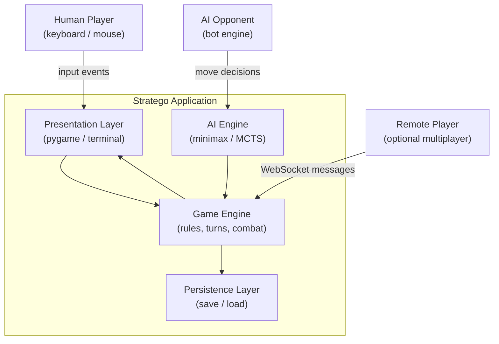

# Stratego – High-Level Architecture Overview

**Document type:** Architecture Overview  
**Version:** 1.0  
**Author:** Software Architect (Python Game Specialist)  
**Status:** Approved

---

## 1. Purpose

This document establishes the high-level architecture for a Python
implementation of the classic two-player board game **Stratego**. It defines
the system boundaries, primary layers, key modules, and the architectural
principles that will guide the detailed design of every subsystem.

All subsequent specification documents in this repository derive from and must
be consistent with this overview.

---

## 2. System Context



### Key External Actors

| Actor | Interaction |
|---|---|
| Human Player | Keyboard / mouse input via the Presentation Layer |
| AI Opponent | Move decisions via the AI Engine |
| Remote Player | Network messages over WebSocket (optional phase 2) |
| File System | Save / load game state via Persistence Layer |

---

## 3. Architectural Style

### 3.1 Primary Pattern: Layered MVC with an Event Bus

A **Model-View-Controller** (MVC) architecture is the primary structural
pattern. An **Event Bus** decouples components and prevents circular
dependencies.

**Why MVC?**

Stratego is a turn-based game with a clear separation between game state,
rules enforcement, and visual representation. Games such as *Battle for
Wesnoth* and numerous open-source chess engines use MVC successfully for
turn-based titles because it:

- Makes the rules engine independently testable (no UI dependency).
- Allows swapping renderers (pygame ↔ terminal ↔ web) without touching game
  logic.
- Maps cleanly to Stratego's phases: setup, turn execution, combat resolution.

**Why not pure ECS (Entity-Component-System)?**

ECS excels for real-time games with thousands of heterogeneous entities (e.g.,
*Factorio*, *Minecraft* at the systems level). Stratego has at most 80 pieces
with fixed, well-defined behaviour. An ECS would add complexity without
meaningful performance benefit. ECS **may** be reconsidered if a future phase
adds real-time animations or particle effects.

> **Industry reference:** The open-source Python project *python-chess* (used
> in production AI research) follows a clean model-first approach similar to
> the MVC pattern recommended here, keeping its `Board` and `Move` objects
> entirely free of rendering concerns.

### 3.2 Supporting Patterns

| Pattern | Where applied | Benefit |
|---|---|---|
| **State Machine** | Game flow (Setup → Playing → Game Over) | Prevents illegal transitions |
| **Command** | Player moves, undo/redo support | Reversible actions, testability |
| **Observer / Event Bus** | UI reacting to model changes | Loose coupling |
| **Strategy** | AI difficulty levels | Swappable algorithms |
| **Repository** | Save / load game state | Decouples persistence format |

---

## 4. Layer Definitions

```mermaid
graph TB
    subgraph Presentation Layer
        PY_UI["pygame Renderer"]
        TERM_UI["Terminal Renderer (fallback)"]
    end

    subgraph Application Layer
        CTRL["Game Controller\n(input → commands)"]
        EVTBUS["Event Bus"]
    end

    subgraph Domain Layer
        ENGINE["Game Engine\n(rules, turn manager)"]
        BOARD["Board Model"]
        PIECES["Piece Models"]
        COMBAT["Combat Resolver"]
        STATE["Game State Machine"]
    end

    subgraph AI Layer
        AIORCH["AI Orchestrator"]
        MINIMAX["Minimax + Alpha-Beta"]
        MCTS["MCTS (optional)"]
        EVALFN["Evaluation Function"]
    end

    subgraph Infrastructure Layer
        PERSIST["Save/Load (JSON / pickle)"]
        NETW["Network Adapter (WebSocket)"]
        CONFIG["Config / Settings"]
    end

    Presentation Layer --> Application Layer
    Application Layer --> Domain Layer
    AI Layer --> Domain Layer
    Domain Layer --> Infrastructure Layer
```

### Layer Responsibilities

**Presentation Layer**
- Renders game board, pieces (visible/hidden), and UI chrome.
- Translates raw OS input events to abstract game actions (e.g., `SelectPiece`,
  `MovePiece`).
- Contains zero game-logic.

**Application Layer (Controller)**
- Receives abstract actions and dispatches Commands to the Domain Layer.
- Manages turn sequencing and player-type routing (human vs. AI vs. network).
- Publishes domain events to the Event Bus.

**Domain Layer**
- The authoritative source of game rules and state.
- Stateless rules engine where possible (functions that receive state and return
  new state or errors).
- Exposes a clean API consumed by the Application Layer and AI Layer.

**AI Layer**
- Implements computer opponents as Strategy implementations.
- Reads game state via domain models; does not directly mutate state.
- Communicates decisions as `Move` value objects back to the Controller.

**Infrastructure Layer**
- Handles all I/O: disk, network, configuration.
- Adapters follow the repository / adapter pattern so the domain layer never
  depends on concrete I/O libraries.

---

## 5. Key Architectural Decisions (Summary)

Full ADRs are in [`adr/`](./adr/).

| # | Decision | Rationale |
|---|---|---|
| ADR-001 | Python 3.12 | Latest stable; `match` statements simplify combat resolution; `dataclasses` + type hints improve model clarity |
| ADR-002 | pygame for primary renderer | Mature, well-documented, extensive community; comparable games (py-chess-gui, open-source clones) use it successfully |
| ADR-003 | MVC + Event Bus over ECS | Turn-based game with small entity count; MVC is simpler, more testable |
| ADR-004 | JSON for save games | Human-readable, debuggable, no external dependencies; protobuf considered but excessive for local play |
| ADR-005 | Minimax + alpha-beta for AI | Proven for two-player zero-sum perfect-information games; Stratego's hidden-information handled via determinised MCTS in phase 2 |

---

## 6. Quality Attribute Goals

| Attribute | Goal | Design approach |
|---|---|---|
| **Testability** | ≥ 80 % domain-layer coverage | Domain layer has zero I/O dependencies |
| **Extensibility** | New AI strategies, renderers without core changes | Strategy pattern, dependency inversion |
| **Performance** | AI move < 1 s at depth-6 | Alpha-beta pruning, bitboard representation |
| **Maintainability** | Clear module ownership | Strict layer discipline; no cross-layer imports |
| **Portability** | Runs on Windows, macOS, Linux | Pure Python + pygame (all cross-platform) |

---

## 7. Folder Structure (Target)

```
stratego/
├── specifications/          ← Architecture documents (this folder)
│   ├── architecture_overview.md
│   ├── system_design.md
│   ├── game_components.md
│   ├── data_models.md
│   ├── technology_stack.md
│   ├── ai_strategy.md
│   └── adr/
│       ├── ADR-001-python-version.md
│       └── ...
├── src/
│   ├── domain/              ← Game Engine, Board, Piece, Combat, State Machine
│   ├── application/         ← Controller, Event Bus, Command objects
│   ├── ai/                  ← AI Orchestrator, Minimax, MCTS
│   ├── presentation/        ← pygame Renderer, Terminal Renderer
│   └── infrastructure/      ← Persistence, Network Adapter, Config
└── tests/
    ├── unit/
    ├── integration/
    └── fixtures/
```

---

## 8. Out of Scope (v1.0)

- Online multiplayer (planned for v2.0 – see `system_design.md`).
- Mobile / web front-end.
- Account management or leaderboards.
- Tournament mode.

---

## 9. Related Documents

| Document | Purpose |
|---|---|
| [`system_design.md`](./system_design.md) | Detailed module-level design |
| [`game_components.md`](./game_components.md) | Game rule encoding and component breakdown |
| [`data_models.md`](./data_models.md) | Domain model definitions and relationships |
| [`technology_stack.md`](./technology_stack.md) | Library choices and justifications |
| [`ai_strategy.md`](./ai_strategy.md) | AI algorithm selection and design |
