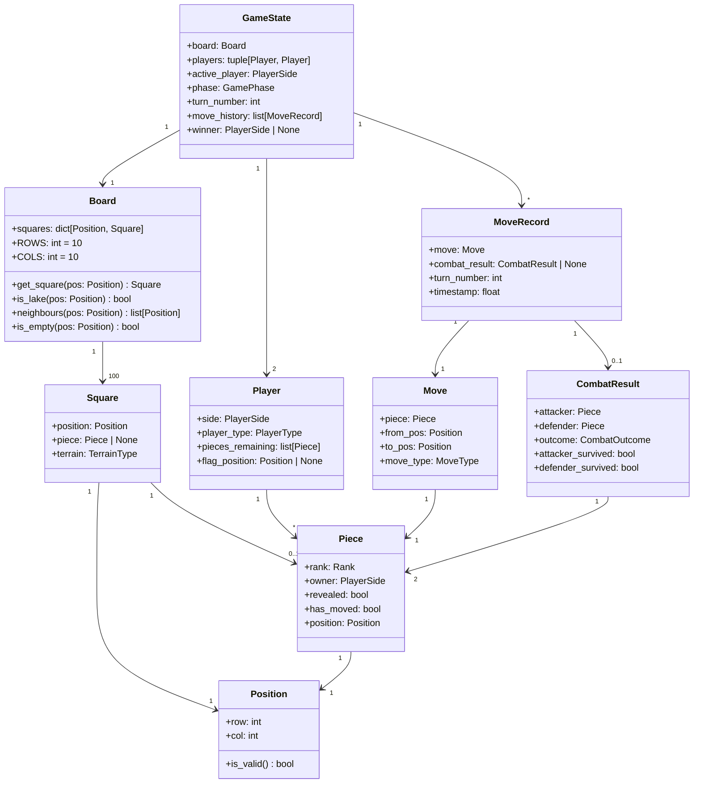

# Stratego – Data Models

**Document type:** Data Models  
**Version:** 1.0  
**Author:** Software Architect (Python Game Specialist)  
**Status:** Approved  
**Depends on:** [`game_components.md`](./game_components.md)

---

## 1. Purpose

This document defines the domain model: the data entities, their attributes,
relationships, and invariants. Implementation teams should map each entity
directly to a Python `dataclass` (or similar immutable record) in
`src/domain/`.

---

## 2. Domain Model Diagram



---

## 3. Entity Definitions

### 3.1 `Rank` – Enumeration

Encodes all piece types. Integer values enable direct comparison for combat
resolution.

| Enum member | Integer value | Notes |
|---|---|---|
| `FLAG` | 0 | Immovable; no combat ability |
| `SPY` | 1 | Beats Marshal when attacking |
| `SCOUT` | 2 | Long-range movement |
| `MINER` | 3 | Defuses Bombs |
| `SERGEANT` | 4 | — |
| `LIEUTENANT` | 5 | — |
| `CAPTAIN` | 6 | — |
| `MAJOR` | 7 | — |
| `COLONEL` | 8 | — |
| `GENERAL` | 9 | — |
| `MARSHAL` | 10 | Highest rank; beaten by Spy |
| `BOMB` | 99 | Immovable; beats all except Miner |

> **Design note:** `BOMB` is assigned 99 rather than 11 to make it unambiguous
> that Bombs are not ranked in the normal sequence. The combat resolver handles
> Bomb and Spy special cases before falling back to integer comparison.

### 3.2 `PlayerSide` – Enumeration

```
RED   → Player 1 (moves first by convention)
BLUE  → Player 2
```

### 3.3 `PlayerType` – Enumeration

```
HUMAN
AI_EASY
AI_MEDIUM
AI_HARD
NETWORK
```

### 3.4 `GamePhase` – Enumeration

```
MAIN_MENU
SETUP
PLAYING
GAME_OVER
```

### 3.5 `TerrainType` – Enumeration

```
NORMAL
LAKE
```

### 3.6 `MoveType` – Enumeration

```
MOVE      → piece moves to empty square
ATTACK    → piece moves to square occupied by enemy
```

### 3.7 `CombatOutcome` – Enumeration

```
ATTACKER_WINS
DEFENDER_WINS
DRAW
```

---

## 4. Invariants

The following rules must hold at all times; the rules engine must enforce them
and never produce a `GameState` that violates them.

| # | Invariant |
|---|---|
| I-1 | A `Position` is valid only if `0 ≤ row ≤ 9` and `0 ≤ col ≤ 9`. |
| I-2 | No two pieces occupy the same `Position`. |
| I-3 | A `LAKE` square never has a piece. |
| I-4 | A `FLAG` or `BOMB` piece never has `has_moved == True`. |
| I-5 | Each player has exactly one `FLAG` piece at game start. |
| I-6 | The `active_player` always alternates after a valid move (no double turns). |
| I-7 | `move_history` entries are append-only (no removal or mutation). |
| I-8 | `winner` is `None` unless `phase == GAME_OVER`. |
| I-9 | `piece.position` always equals the `Position` of the `Square` that contains it. |
| I-10 | `Player.pieces_remaining` contains exactly the pieces still on the board for that player. |

---

## 5. Key Relationships

### 5.1 Board ↔ Piece (source of truth)

The `Board` is the authoritative source for piece positions. `Piece.position`
is a *cached* convenience attribute updated whenever the board changes.
Consumers should prefer `board.get_square(pos).piece` over `piece.position`
when iterating the board.

### 5.2 GameState Immutability

`GameState` is designed as an **immutable snapshot**. The rules engine
produces a *new* `GameState` for each move rather than mutating in place.
This enables:

- Simple undo/redo (keep a stack of `GameState` objects).
- Safe multi-threaded AI search (AI receives a copy of the state, cannot
  corrupt the live game).
- Easy save / load (serialise any `GameState` snapshot).

> **Precedent:** The `python-chess` library uses the same immutable `Board`
> design with `push()` / `pop()` and a copy-based approach for its search
> tree, and it supports FIDE-level chess engines at high performance.

---

## 6. Serialisation Contract

`GameState` must be serialisable to and from JSON. The JSON schema must
include:

```json
{
  "version": "1.0",
  "phase": "PLAYING",
  "active_player": "RED",
  "turn_number": 14,
  "board": {
    "squares": [
      { "row": 0, "col": 0, "terrain": "NORMAL", "piece": null },
      { "row": 0, "col": 1, "terrain": "NORMAL",
        "piece": { "rank": "SCOUT", "owner": "BLUE", "revealed": false, "has_moved": true }
      }
    ]
  },
  "move_history": [
    {
      "turn": 1,
      "from": [6, 4], "to": [5, 4],
      "move_type": "MOVE",
      "combat_result": null
    }
  ],
  "winner": null
}
```

**Versioning:** The `"version"` field enables future schema migrations.
Infrastructure layer must validate the version before deserialising and
reject files with unknown versions with a clear error message.

---

## 7. Related Documents

| Document | Purpose |
|---|---|
| [`game_components.md`](./game_components.md) | Rules that shape the model |
| [`system_design.md`](./system_design.md) | Module that owns each entity |
| [`technology_stack.md`](./technology_stack.md) | Serialisation library choices |
