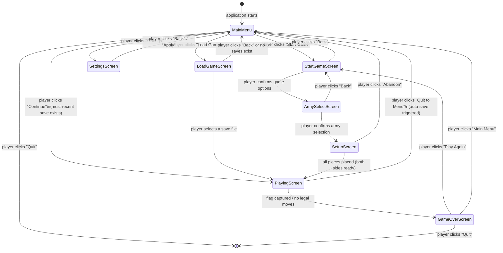
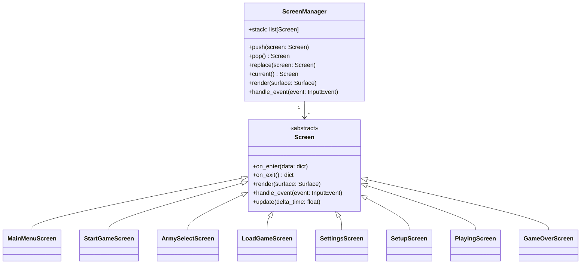

# Conqueror's Quest – Screen Flow Specification

**Document type:** Screen Flow  
**Version:** 1.0  
**Author:** Software Architect (Python Game Specialist)  
**Status:** Approved  
**Depends on:** [`architecture_overview.md`](./architecture_overview.md), [`system_design.md`](./system_design.md)

---

## 1. Purpose

This document defines the complete screen-navigation graph for *Conqueror's
Quest*. It specifies every screen, the controls and conditions that trigger
transitions between screens, and the data that must be carried across each
transition.

All screens are implemented as classes inside `src/presentation/screens/` and
registered with the `ScreenManager` in the Application Layer.

---

## 2. Screen-Flow Diagram



---

## 3. Screen Descriptions

### 3.1 Main Menu Screen

**Class:** `MainMenuScreen`  
**Entry condition:** Application start, or returning from any other screen.  
**Background:** Full-screen artwork / animated title card (GIF or static image).

| Control | Action |
|---|---|
| **Start Game** button | → `StartGameScreen` |
| **Continue** button | → `PlayingScreen` (loads most-recent save); button is **greyed out** if no save file exists |
| **Load Game** button | → `LoadGameScreen` |
| **Settings** button | → `SettingsScreen` |
| **Quit** button | Graceful application exit |

**Data carried out:** none.

---

### 3.2 Start Game Screen

**Class:** `StartGameScreen`  
**Entry condition:** Player clicked "Start Game" from Main Menu.  
**Purpose:** Configure the new game session before army selection.

| Control | Description | Values |
|---|---|---|
| **Number of Players** toggle | Choose game mode | `2 Players` / `vs AI` |
| **AI Difficulty** selector | Shown only when `vs AI` is selected | `Easy` / `Medium` / `Hard` |
| **Confirm** button | Validates selections and advances | → `ArmySelectScreen` |
| **Back** button | Returns without saving | → `MainMenu` |

**Data carried out to `ArmySelectScreen`:**

```
game_mode: GameMode          # TWO_PLAYER | VS_AI
ai_difficulty: Difficulty    # EASY | MEDIUM | HARD (null if TWO_PLAYER)
```

**UI notes:**
- The AI Difficulty row animates in/out based on the mode toggle.
- Hovering any difficulty option shows a brief description tooltip.

---

### 3.3 Army Select Screen

**Class:** `ArmySelectScreen`  
**Entry condition:** Player confirmed options on `StartGameScreen`.  
**Purpose:** Each human player picks the army (mod) they wish to use. If
playing vs AI, only Player 1 picks an army; the AI uses a built-in default or
a randomly selected loaded army.

| Control | Description |
|---|---|
| **Army dropdown (Player 1)** | Lists all loaded armies; includes built-in "Classic" army |
| **Army dropdown (Player 2)** | Shown only in 2-player mode; same list |
| **Preview panel** | Shows army name, unit custom names, and a sample piece image |
| **Confirm** button | → `SetupScreen` |
| **Back** button | → `StartGameScreen` |

**Data carried out to `SetupScreen`:**

```
player1_army: ArmyMod
player2_army: ArmyMod    # may equal player1_army
ai_difficulty: Difficulty | None
```

---

### 3.4 Load Game Screen

**Class:** `LoadGameScreen`  
**Entry condition:** Player clicked "Load Game" from Main Menu.  
**Purpose:** Browse and select a previously saved game to resume.

| Control | Description |
|---|---|
| **Save file list** | Scrollable list of save files, sorted newest-first; each entry shows date/time and turn number |
| **Load** button | Loads the selected save → `PlayingScreen` |
| **Delete** button | Deletes the selected save (confirmation dialog shown) |
| **Back** button | → `MainMenu` |

**Empty-state message:** "No saved games found. Start a new game to create a save."

---

### 3.5 Settings Screen

**Class:** `SettingsScreen`  
**Entry condition:** Player clicked "Settings" from Main Menu.  
**Purpose:** Adjust display, audio, and game-play preferences.

| Setting | Type | Description |
|---|---|---|
| **Resolution** | Dropdown | Supported screen resolutions |
| **Fullscreen** | Toggle | Windowed vs fullscreen |
| **FPS cap** | Slider (30–144) | Display frame rate |
| **Sound effects** | Toggle + volume slider | Enable/disable and volume |
| **Music** | Toggle + volume slider | Background music on/off |
| **Army mod folder** | Folder picker | Path where custom army mods are stored |
| **Apply** button | Saves to `config.yaml`; returns → `MainMenu` |
| **Reset to defaults** button | Restores factory config |
| **Back** button | Discards changes → `MainMenu` |

---

### 3.6 Board Setup Screen

**Class:** `SetupScreen`  
**Entry condition:** Army selection confirmed; game session initialised.  
**Purpose:** Each human player places their 40 pieces in their setup zone.

| Control | Description |
|---|---|
| Drag-and-drop pieces | Place pieces from the piece tray onto setup rows |
| **Auto-arrange** button | Fills the board with a random valid arrangement |
| **Clear** button | Returns all pieces to the tray |
| **Ready** button | Locks in placement; shown once all 40 pieces are placed |

**Multiplayer note:** In 2-player local mode, the screen transitions between
players and hides the opponent's already-placed pieces during each player's
setup turn.

**AI note:** When playing vs AI, the AI's setup is generated instantly by the
opening book; only Player 1 uses this screen.

---

### 3.7 Playing Screen

**Class:** `PlayingScreen`  
**Entry condition:** Both sides ready after Setup, or game loaded from save.  
**Purpose:** Main in-game view.

| Region | Contents |
|---|---|
| **Board area** | 10×10 grid with piece sprites; lakes highlighted |
| **Side panel** | Active player indicator; captured pieces list; turn counter |
| **Controls bar** | "Save Game", "Quit to Menu", "Undo" (if enabled in settings) |

**Event subscriptions:** `PieceMoved`, `CombatResolved`, `TurnChanged`,
`GameOver`, `InvalidMove` — all update the board display reactively via the
Event Bus.

---

### 3.8 Game Over Screen

**Class:** `GameOverScreen`  
**Entry condition:** `GameOver` event received in `PlayingScreen`.

| Control | Action |
|---|---|
| **Play Again** button | → `StartGameScreen` |
| **Main Menu** button | → `MainMenu` |
| **Quit** button | Graceful exit |

Displays winner name, winning condition (flag captured / no legal moves), and
total turn count.

---

## 4. ScreenManager and Navigation Stack

All screens are managed by a central `ScreenManager` (in `src/application/`)
that maintains a screen stack. Navigation rules:

- `push(screen)` – renders the new screen on top; previous screen paused.
- `pop()` – returns to the previous screen.
- `replace(screen)` – replaces the current screen (used for major transitions
  such as Main Menu → Playing to avoid memory accumulation).



---

## 5. Data Passed Between Screens

Screens exchange data through the `on_exit()` / `on_enter(data)` interface.
The `ScreenManager` passes the dict returned by `on_exit()` directly to
`on_enter(data)` of the next screen.

| Transition | Data keys |
|---|---|
| `StartGameScreen` → `ArmySelectScreen` | `game_mode`, `ai_difficulty` |
| `ArmySelectScreen` → `SetupScreen` | `player1_army`, `player2_army`, `game_mode`, `ai_difficulty` |
| `SetupScreen` → `PlayingScreen` | `game_state` (initial `GameState` snapshot) |
| `LoadGameScreen` → `PlayingScreen` | `game_state` (deserialised `GameState` snapshot) |
| `PlayingScreen` → `GameOverScreen` | `winner`, `winning_condition`, `final_state` |

---

## 6. Continue Button – Most-Recent Save Logic

The **Continue** button on the Main Menu loads the single most-recently
written save file without showing the Load Game screen.

```
most_recent_save = JsonRepository.get_most_recent_save()
if most_recent_save is None:
    disable Continue button (greyed out)
else:
    on Continue click → load most_recent_save → PlayingScreen
```

This is implemented in `MainMenuScreen.on_enter()` which queries
`JsonRepository` via the Application Layer.

---

## 7. Related Documents

| Document | Purpose |
|---|---|
| [`architecture_overview.md`](./architecture_overview.md) | Architectural principles and layer definitions |
| [`system_design.md`](./system_design.md) | Module inventory including `screens/` |
| [`custom_armies.md`](./custom_armies.md) | Custom army / mod system that ArmySelectScreen exposes |
| [`data_models.md`](./data_models.md) | `GameState` and `ArmyMod` data structures |
