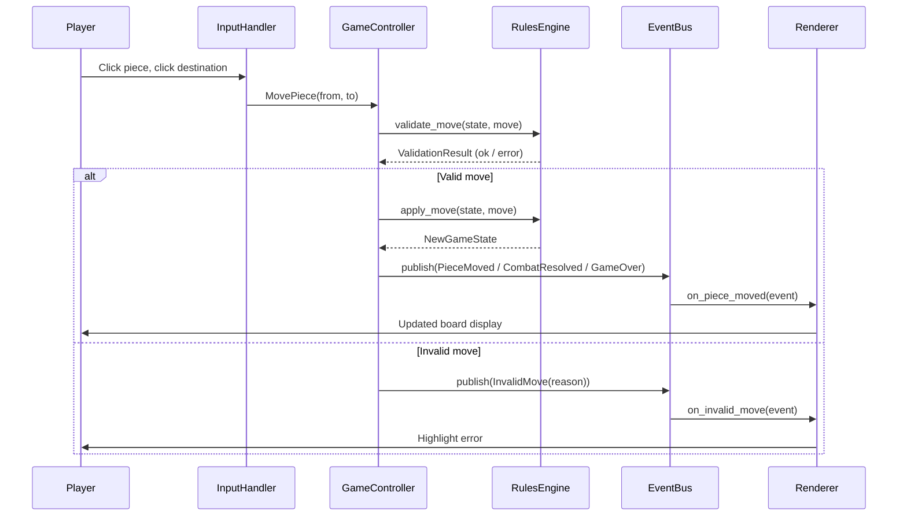
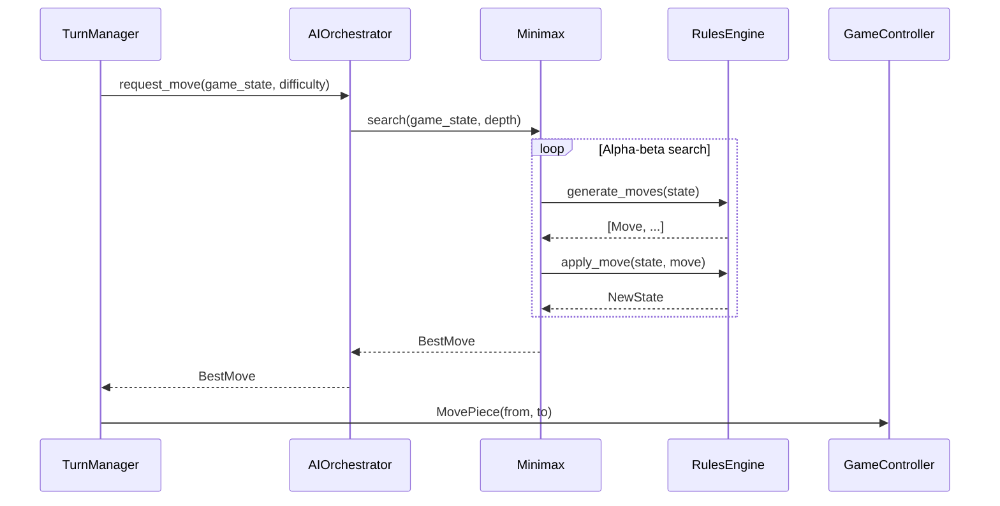
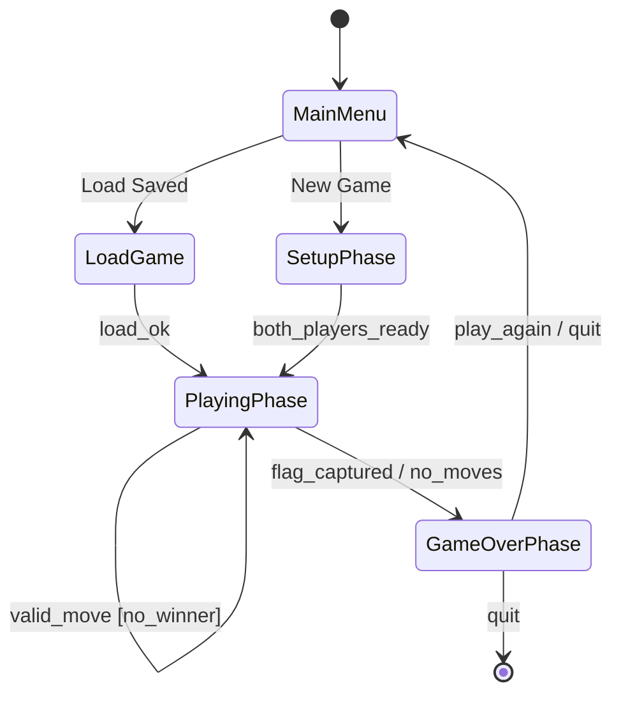
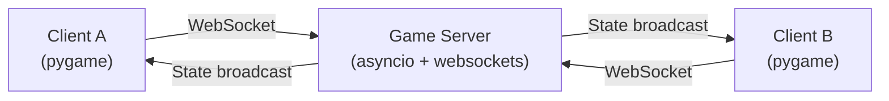

# Stratego – System Design

**Document type:** System Design  
**Version:** 1.0  
**Author:** Software Architect (Python Game Specialist)  
**Status:** Approved  
**Depends on:** [`architecture_overview.md`](./architecture_overview.md)

---

## 1. Purpose

This document provides the module-level design for the Stratego Python
application, expanding the layers described in `architecture_overview.md` into
concrete packages, their responsibilities, public interfaces, and interaction
flows.

---

## 2. Module Inventory

### 2.1 Domain Layer – `src/domain/`

| Module | Responsibility |
|---|---|
| `board.py` | Immutable 10×10 grid representation; square lookup; neighbour queries |
| `piece.py` | Piece rank, owner, visibility, capture rules |
| `player.py` | Player identity, remaining pieces, flag location |
| `game_state.py` | Snapshot of the full game; drives the State Machine |
| `rules_engine.py` | Validates moves; resolves combat; detects win/loss |
| `move.py` | Value object representing a single piece movement |
| `combat.py` | Combat resolution table; spy/miner/marshal special rules |
| `state_machine.py` | Enforces legal game-phase transitions |

### 2.2 Application Layer – `src/application/`

| Module | Responsibility |
|---|---|
| `game_controller.py` | Top-level orchestrator; routes commands to domain |
| `event_bus.py` | Publish/subscribe hub; decouples domain from UI and AI |
| `commands.py` | Immutable command value objects (`PlacePiece`, `MovePiece`) |
| `turn_manager.py` | Alternates turns; notifies AI when it is the AI's turn |
| `session.py` | Manages a single game session lifecycle |

### 2.3 AI Layer – `src/ai/`

| Module | Responsibility |
|---|---|
| `ai_orchestrator.py` | Selects and invokes the appropriate algorithm |
| `minimax.py` | Minimax with alpha-beta pruning |
| `mcts.py` | Monte Carlo Tree Search (phase 2 – hidden information) |
| `evaluation.py` | Board evaluation heuristics (material, mobility, flag safety) |
| `opening_book.py` | Hard-coded strong opening setups |

### 2.4 Presentation Layer – `src/presentation/`

| Module | Responsibility |
|---|---|
| `pygame_renderer.py` | Renders board, pieces, animations using pygame |
| `terminal_renderer.py` | ASCII fallback for headless / testing environments |
| `sprite_manager.py` | Loads and caches piece sprites and board assets |
| `input_handler.py` | Translates pygame events → abstract `InputEvent` objects |
| `screens/` | `SetupScreen`, `GameScreen`, `ResultScreen` state-specific views |

### 2.5 Infrastructure Layer – `src/infrastructure/`

| Module | Responsibility |
|---|---|
| `json_repository.py` | Serialises/deserialises `GameState` to/from JSON files |
| `network_adapter.py` | WebSocket client/server for multiplayer (v2.0) |
| `config.py` | Loads settings from `config.yaml`; provides defaults |
| `logger.py` | Structured logging; wraps Python `logging` module |

---

## 3. Component Interaction – Game Turn Flow



---

## 4. Component Interaction – AI Turn Flow



---

## 5. Game Phase State Machine



**State descriptions**

| State | Entry condition | Exit condition |
|---|---|---|
| `MainMenu` | Application start | Player selects New Game or Load |
| `SetupPhase` | New game started | All 40 pieces placed for both sides |
| `PlayingPhase` | Setup complete | Flag captured or a player has no legal moves |
| `GameOverPhase` | Win/loss detected | Player chooses to replay or quit |

---

## 6. Event Catalogue

The Event Bus carries the following domain events. All events are immutable
value objects (Python `dataclass` with `frozen=True`).

| Event | Published by | Consumed by |
|---|---|---|
| `PiecePlaced(pos, piece)` | `GameController` | `Renderer` |
| `PieceMoved(from_pos, to_pos, piece)` | `GameController` | `Renderer`, `Logger` |
| `CombatResolved(attacker, defender, winner)` | `RulesEngine` | `Renderer`, `Logger` |
| `TurnChanged(active_player)` | `TurnManager` | `Renderer`, `AIOrchestrator` |
| `GameOver(winner, reason)` | `RulesEngine` | `Renderer`, `Logger`, `Session` |
| `InvalidMove(player, move, reason)` | `RulesEngine` | `Renderer` |
| `GameSaved(filepath)` | `JsonRepository` | `Renderer` |
| `GameLoaded(game_state)` | `JsonRepository` | `GameController` |

---

## 7. Configuration Schema

Settings are loaded from `config.yaml` at application start. All values have
sensible defaults defined in code so the file is optional.

```yaml
# Example config.yaml (documentation only – not implementation code)
display:
  width: 1024
  height: 768
  fullscreen: false
  fps_cap: 60

ai:
  default_difficulty: medium   # easy | medium | hard
  search_depth:
    easy: 2
    medium: 4
    hard: 6
  time_limit_ms: 950           # hard cap on AI thinking time

persistence:
  save_directory: ~/.stratego/saves
  autosave: true
  autosave_interval_turns: 5

logging:
  level: INFO
  file: ~/.stratego/stratego.log
```

---

## 8. Error Handling Strategy

| Error category | Strategy |
|---|---|
| Invalid player input | Validate at Controller boundary; publish `InvalidMove` event; never crash |
| Corrupt save file | Catch deserialisation errors; present user-friendly message; log full stack trace |
| AI time-out | Return best move found so far when `time_limit_ms` is exceeded |
| Network disconnect (v2.0) | Pause game; attempt reconnect × 3; offer to save and exit |
| Unexpected exception | Top-level `try/except` in main loop; log; show error screen; allow graceful exit |

---

## 9. Multiplayer Architecture (v2.0 Preview)

Phase 2 will add optional online multiplayer via WebSocket. The domain layer
requires **zero changes** – only a new `NetworkAdapter` in the infrastructure
layer and routing logic in `GameController` to relay moves.



**Design decision:** The server holds the authoritative `GameState`. Clients
send `Move` commands and receive full state updates, preventing cheating by
never trusting client-side state.

---

## 10. Related Documents

| Document | Purpose |
|---|---|
| [`architecture_overview.md`](./architecture_overview.md) | Architectural principles and layer definitions |
| [`game_components.md`](./game_components.md) | Detailed breakdown of Stratego game rules and rule encoding |
| [`data_models.md`](./data_models.md) | Domain model definitions |
| [`technology_stack.md`](./technology_stack.md) | Library choices |
| [`ai_strategy.md`](./ai_strategy.md) | AI algorithm detail |
